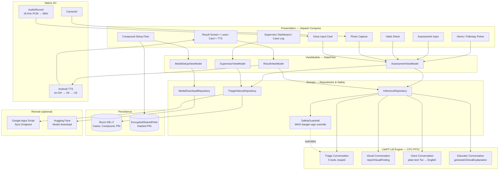

# TriageMate

**On-device clinical triage assistant for Ghana Community Health Officers (CHOs).**

TriageMate is an Android app that helps CHOs at CHPS compounds rapidly assess and refer sick children under 5 and pregnant mothers — fully offline, with all clinical reasoning running on-device via Google's [Gemma 4 E2B](https://huggingface.co/litert-community/gemma-4-E2B-it-litert-lm) through LiteRT-LM.

The app is built around an **agentic multi-tool loop**: Gemma plans which clinical tools to call (`assessSymptoms`, `requestVitalSigns`, `checkDrugInteraction`, `classifyTriage`, `generateReferralNote`) and the Kotlin layer enforces a WHO-aligned safety guardrail on top of the model's output.

---

## What's in the box

- **Core capabilities**
  - Agentic multi-tool triage loop with vitals pause/resume
  - Voice input in Twi (Akan) translated on-device by Gemma's audio encoder
  - Multimodal photo capture for visual signs (jaundice, rashes, swelling)
  - Compound setup, PIN-gated supervisor dashboard, and offline sync
  - Hard-coded clinical safety guardrail (WHO IMCI danger signs override the model)
  - "Learn about this case" educator card and TTS readback of the triage outcome
- **Two clinical pathways** — `CHILD_U5` (under-fives, IMCI) and `ANTENATAL` (Ghana Health Service ANC)
- **Fully offline inference** — internet is only used for first-run model download and (optional) supervisor sync upload

---

## Architecture at a glance



**Backend choice:** the language model runs on **CPU (FP32)** for tool-call stability. GPU is currently disabled because the LiteRT-LM GPU delegate runs Gemma at FP16, which corrupts structured tool-call tokens — re-enable in `EngineProvider.selectBackend()` only after a higher-precision GPU delegate ships.

---

## Prerequisites

- **Android Studio** Ladybug (2024.2) or newer
- **JDK 17**
- **Android SDK 35** (compileSdk) / API 26+ (minSdk)
- A physical device or emulator with **≥6 GB RAM**. The Gemma 4 E2B `.litertlm` model is 2.58 GB and the LiteRT runtime holds it resident.
- About **3 GB free storage** on the test device for the model file.
- An emulator alone is *not* sufficient if you want to exercise the camera or microphone — use a physical device for voice input and photo capture.

---

## Running the project

### 1. Clone and open
```bash
git clone <repo-url> TriageMate
cd TriageMate
```
Open in Android Studio. Let Gradle sync.

### 2. Configure `local.properties`
`local.properties` is **gitignored** — you must create it yourself. The build reads two TriageMate-specific keys from it and exposes them as `BuildConfig` fields (`SYNC_ENDPOINT_URL`, `SYNC_SECRET`) consumed by `data/sync/SyncEngine.kt`.

Add the following lines to `local.properties` (the `sdk.dir` line will already be there after Android Studio's first sync):

```properties
sdk.dir=/path/to/your/Android/Sdk

# TriageMate supervisor sync — Google Apps Script web app
SYNC_ENDPOINT_URL=https://script.google.com/macros/s/AKfycbwix_ZNdlLo46ChhMCRWiuLfUbSvEYrOkJFmImHWIdSolD8uGz8WYLaFIk_aJr8s7VKVw/exec
SYNC_SECRET=triagemate2026ghana
```

Notes:
- The endpoint is a Google Apps Script web app that receives JSON-encoded triage cases from the supervisor dashboard's "Sync now" flow. It's safe to call from outside the app — there's no PII exfiltration, only de-identified case metadata.
- `SYNC_SECRET` is a shared HMAC-style token the Apps Script validates before accepting a payload. **Rotate this for production deployments** — the value above is for local dev/demos only.
- If you leave both blank, the app still builds; sync calls become no-ops and the dashboard shows "offline".

### 3. Get the model file on the device
TriageMate downloads `gemma-4-E2B-it.litertlm` (2.58 GB) on first launch using `DownloadManager`. The in-app screen guides the user through it.

If you'd rather side-load it (faster for repeated installs / CI):

```bash
# Download once on your dev machine
curl -L -o gemma-4-E2B-it.litertlm \
  "https://huggingface.co/litert-community/gemma-4-E2B-it-litert-lm/resolve/main/gemma-4-E2B-it.litertlm?download=true"

# Push to the app's external files dir
adb push gemma-4-E2B-it.litertlm /sdcard/Android/data/com.triagemate.chps/files/
```

The app checks `getExternalFilesDir(null)/gemma-4-E2B-it.litertlm` on every launch and skips the download screen if it's there.

### 4. Build and install
```bash
./gradlew :app:installDebug
```
Or hit ▶ in Android Studio with a device selected.

### 5. First-run flow
1. **Model download screen** — either downloads from Hugging Face or detects the side-loaded file.
2. **Compound setup wizard** — name, location, supervisor PIN. Sets up Room DB and EncryptedSharedPreferences.
3. **Home screen** — choose `CHILD_U5` or `ANTENATAL` and start triaging.

### 6. Supervisor dashboard
From the home screen → menu → "Supervisor". Enter the PIN you set in step 5's wizard. The dashboard shows case counts, urgency distribution, and a "Sync now" button that posts to `SYNC_ENDPOINT_URL`.

---

## Useful Gradle tasks

| Task | What it does |
|---|---|
| `./gradlew :app:compileDebugKotlin` | Fast type-check; doesn't package the APK. |
| `./gradlew :app:assembleDebug` | Build the debug APK. |
| `./gradlew :app:installDebug` | Build and install to the connected device. |
| `./gradlew :app:test` | Run JVM unit tests. |
| `./gradlew :app:connectedAndroidTest` | Run instrumented tests on the connected device. |

---

## Project layout

```
app/src/main/java/com/triagemate/chps/
├── data/
│   ├── engine/            # EngineProvider — LiteRT-LM lifecycle
│   ├── repository/        # Inference, history, model download, sync
│   ├── db/                # Room entities, DAOs, migrations
│   └── sync/              # SyncEngine — talks to Apps Script
├── domain/
│   ├── model/             # TriageInput, TriageResult, VisualFinding, etc.
│   ├── repository/        # Repository interfaces
│   ├── safety/            # SafetyGuardrail — WHO danger-sign override
│   └── tools/             # ClinicalToolSet — @Tool-annotated functions
├── presentation/
│   ├── screens/           # Compose screens (home, assessment, result, supervisor, setup)
│   ├── components/        # VoiceInputCard, ClinicalPhotoCard, VitalSignsSheet, ...
│   ├── navigation/        # AppNavGraph, SetupNavGraph
│   └── theme/             # Brand colors (PrimaryNavy = teal #00897B)
├── util/
│   ├── PromptBuilder.kt   # All Gemma system + user prompts
│   ├── AudioRecorderManager.kt  # 16 kHz PCM → WAV
│   ├── TextToSpeechManager.kt
│   └── Constants.kt
└── di/                    # Hilt modules
```

---

## Troubleshooting

- **"Model is not available on this device"** — the `.litertlm` file isn't where the app expects. Confirm `adb shell ls /sdcard/Android/data/com.triagemate.chps/files/` shows `gemma-4-E2B-it.litertlm` (2.58 GB).
- **`miniaudio decoder error -10`** during voice input — should no longer occur; if it does, the PCM-to-WAV wrapping in `AudioRecorderManager.pcmToWav()` is the relevant code.
- **`TTS init failed status=-1`** — the device has no working TTS engine. Install **Speech Services by Google** from the Play Store and set it as the default TTS engine in Settings → Accessibility → Text-to-speech output.
- **Triage "exceeded maximum tool-call rounds"** — model drifted off the tool schema; reduce conversation length or check the `recoverFromParseError` path in `InferenceRepositoryImpl`. Auto-RED danger signs already short-circuit to a rule-based result.
- **Build error: `BuildConfig.SYNC_ENDPOINT_URL` not found** — you skipped step 2. Add the keys to `local.properties` and re-sync Gradle.

---

## Licensing & data

- The Gemma 4 E2B model is distributed by Google under the [Gemma Terms of Use](https://ai.google.dev/gemma/terms).
- TriageMate stores all triage cases locally in Room. The supervisor "Sync now" upload is de-identified — no patient names or free-text notes leave the device.
- Audio recordings used for Twi voice input are processed in-memory and never written to disk.
